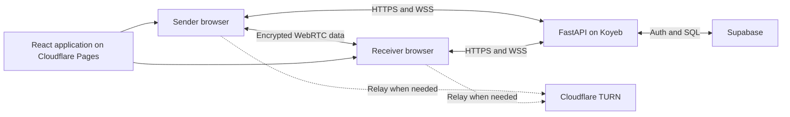

# E2E Secure File Transfer System

This project is a browser-based file transfer application for moving a file between two devices on the same account. The sender encrypts the file in the browser and sends it over a WebRTC data channel. The application server handles accounts, devices, presence, signaling, and short-lived TURN credentials. It does not receive or store the file.

The repository is still in the design stage. The protocol and security assumptions are documented before implementation so they can be tested against the code later.

## Planned v1

- Passwordless account bootstrap and recovery through a Supabase email OTP
- Persistent, revocable application sessions stored in secure cookies
- Per-device signing keys generated with the Web Crypto API
- Approval of new devices from an existing trusted device
- Direct browser-to-browser transfer through WebRTC
- Cloudflare TURN fallback when a direct connection is unavailable
- Application-layer encryption with ephemeral ECDH P-256, HKDF-SHA-256, and AES-256-GCM
- ECDSA P-256 signatures for device identity and handshake authentication
- A 250 MB file limit, with both devices online and the site open

## Security boundary

The sender encrypts the file before it enters the WebRTC channel. The receiver decrypts it in its own browser. FastAPI, Supabase, Cloudflare TURN, and the hosting providers do not receive file plaintext during normal operation.

The web host is trusted because it supplies the JavaScript that performs the cryptography. A compromised host could serve altered code and defeat the encryption. Compromised browsers, operating systems, and recipient devices are also outside the protection offered by the protocol. These limits are discussed in [the threat model](docs/threat-model.md).

## Architecture



The backend is a browser-facing API rather than a file proxy. File throughput normally depends on the peers' connection. If WebRTC falls back to TURN, Cloudflare relays the encrypted packets.

## Stack

| Area | Choice |
| --- | --- |
| Frontend | React, TypeScript, Vite |
| Browser cryptography | Web Crypto API |
| Peer transport | WebRTC DataChannel |
| Backend | Python, FastAPI, WebSockets |
| Database and identity proof | Supabase PostgreSQL and Auth |
| TURN | Cloudflare Realtime TURN |
| Frontend hosting | Cloudflare Pages |
| Backend hosting | Koyeb Eco Micro in Singapore |
| Public hostname | An `is-a.dev` subdomain, subject to approval |
| Auth email | Provider-neutral SMTP; Resend is the first provider to test |

## Documentation

- [Project specification](docs/project-specification.md)
- [Architecture](docs/architecture.md)
- [Threat model](docs/threat-model.md)
- [Authentication and device lifecycle](docs/authentication-and-devices.md)
- [Transfer protocol](docs/transfer-protocol.md)
- [Data model](docs/data-model.md)
- [Deployment](docs/deployment.md)
- [Testing strategy](docs/testing-strategy.md)
- [Decision log](docs/decision-log.md)
- [Implementation plan](docs/implementation-plan.md)
- [Security policy](SECURITY.md)

## Project status

- [x] Scope and trust assumptions agreed
- [x] Technology and hosting choices agreed
- [x] Authentication and cryptographic design documented
- [x] Application scaffold
- [ ] Authentication and device management
- [ ] Signaling and WebRTC transport
- [ ] Encrypted file transfer
- [ ] Public deployment and email verification
- [ ] Security testing and release documentation

Production setup instructions will be added in the deployment phase. No production secrets belong in this repository.

## Local development

The Phase 0 scaffold runs the frontend and backend independently. Install Node.js 20+ and Python 3.12+ with [uv](https://docs.astral.sh/uv/) available.

From `frontend/`, install dependencies and start the Vite server:

```text
npm install
npm run dev
```

The frontend health page is then available at `http://localhost:5173`.

From `backend/`, create the pinned Python environment and start FastAPI:

```text
uv sync
uv run uvicorn app.main:app --reload --port 8000
```

The API health check is available at `http://localhost:8000/health`. Run its test with `uv run pytest` and build the frontend with `npm run build`. The `.env.example` files contain safe local placeholders only; copy them to `.env` when configuration is added in a later phase.
