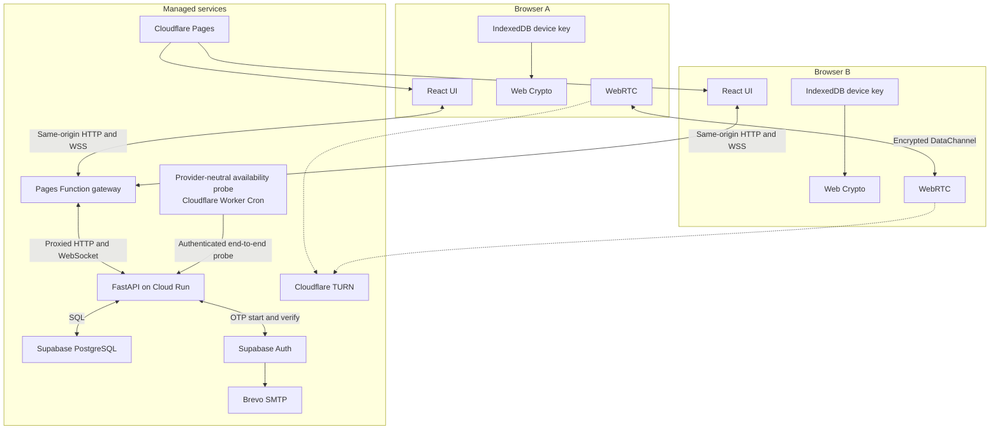
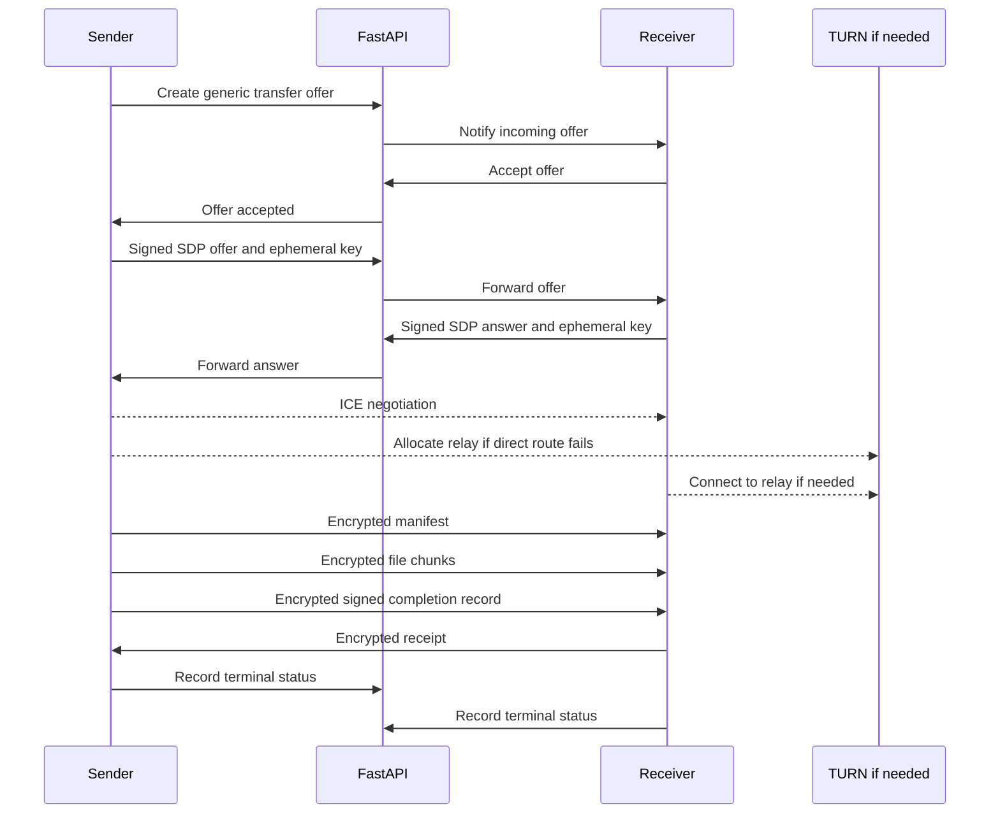

# Architecture

## System shape

The application has a control plane and a data plane. FastAPI owns the control plane: accounts, sessions, devices, presence, signaling, and TURN authorization. Browsers own the data plane: they agree on transfer keys, encrypt the file, and move it over WebRTC.



## Component responsibilities

### React client

The client renders account, device, and transfer state. It generates device and transfer keys with Web Crypto, stores the non-extractable device key in IndexedDB, verifies peer signatures, encrypts and decrypts transfer frames, and manages WebRTC backpressure.

The client treats file names and MIME types as untrusted display data. It does not render transferred HTML or automatically open a received file.

### FastAPI

FastAPI is the only public application backend. Its responsibilities are:

- proxying the start and verification steps for Supabase email OTP
- creating opaque application sessions and CSRF tokens
- issuing and checking device-authentication challenges
- registering, listing, and revoking devices
- coordinating pairing approval
- tracking online device presence
- forwarding WebRTC descriptions and ICE candidates
- issuing short-lived TURN credentials after authorization
- recording limited security and transfer events
- enforcing account ownership, quotas, expiry, and rate limits

FastAPI does not accept file uploads. A route that could receive an arbitrary file body is outside the design.

### Hosting availability module

Availability is a separate frontend wrapper in `frontend/src/availability/`, backend package/router in `backend/app/availability/`, and provider-neutral operations probe in `ops/availability-probe/`. The frontend wrapper makes a bounded HTTP wake/readiness request before handing control to the existing presence/WebSocket client. It exposes bounded states and capped retries with backoff and jitter, but does not duplicate the presence client's reconnect loop.

The backend package exposes only minimal wake, readiness, and authenticated probe surfaces. Its database connectivity check has a short timeout and returns a safe status without database details, secrets, or other sensitive diagnostics. The operations probe is deployed separately, initially with Cloudflare Worker Cron three times per day by default, with a configurable schedule, and performs a low-frequency authenticated end-to-end check that reaches the database. Probe credentials live only in host secret stores. These modules are composed and wired at application boundaries with the existing control-plane modules without changing their contracts; no hosting-provider branches enter existing presence, transfer, or protocol modules.

### Supabase

Supabase Auth proves control of an email address for account bootstrap and recovery. Supabase PostgreSQL stores application records in a private schema. The frontend does not receive the service role key and does not query application tables directly.

FastAPI connects with a dedicated database role limited to the tables and operations it needs. Migrations own schema changes. If any table is placed in an exposed schema, it must have row-level security and must not grant broad access to `anon` or `authenticated`.

### Cloudflare Pages

Pages hosts the static Vite build at its assigned `pages.dev` hostname and sets the browser security headers described in [deployment.md](deployment.md). A narrowly scoped Pages Function gateway forwards API and WebSocket traffic to Cloud Run. The gateway keeps the browser on the Pages origin for host-only cookies but does not own application authorization or accept file data.

### Cloudflare TURN

TURN is a fallback relay for WebRTC. FastAPI obtains or creates time-limited credentials only for an authenticated, accepted transfer. The relay can observe IP addresses, timing, and volume, but application encryption prevents it from reading the manifest or file.

### SMTP provider

Supabase Auth calls Brevo through custom SMTP. Application code does not contain a Brevo dependency. Version 1 verifies an individual sender address instead of authenticating an owned domain, so Brevo may replace the visible sender with a provider-managed transactional address. External-recipient delivery remains a Phase 11 release check.

## Public URLs

| URL | Purpose |
| --- | --- |
| `https://<pages-project>.pages.dev` | React application plus the browser-facing API and WebSocket gateway |
| Cloud Run's assigned `https://*.run.app` URL | FastAPI upstream and authenticated operations probe target |

The browser does not call the Cloud Run origin directly. HTTP and WebSocket requests enter through the Pages origin, allowing the session cookie to remain `Secure`, `HttpOnly`, `SameSite=Lax`, host-only, and scoped to `/`. FastAPI still validates the exact Pages `Origin`; the gateway is transport glue rather than an authorization boundary.

## Authentication boundary

The browser never stores a Supabase refresh token. During email bootstrap or recovery, FastAPI completes the OTP exchange, validates the returned identity, creates an application user or recovery transaction, and issues its own opaque session.

The session cookie contains a random identifier, not a JWT or user data. The database stores only its cryptographic hash. FastAPI checks revocation, idle expiry, absolute expiry, the associated device, and the account device epoch on each authenticated request.

A trusted device whose application session has expired can sign a fresh challenge. The signature proves possession of the registered device key and allows FastAPI to issue a new session without another email.

## WebSocket boundary

An authenticated HTTP request creates a single-use WebSocket ticket with a short expiry. The client presents that ticket when opening the socket. FastAPI consumes it once, verifies the `Origin` header, associates the connection with one session and device, then publishes presence.

The socket accepts only typed signaling messages with bounded payloads. Every transfer message includes a transfer identifier, sender device, recipient device, protocol version, and expiry. The backend rejects cross-account routing even if a valid device identifier is supplied.

Presence is advisory. A device may disappear without a clean close, so the backend uses heartbeats and expiry rather than treating a socket close as the only source of truth.

## Transfer sequence



The generic offer does not contain a file name, MIME type, or size. The receiver learns those values from the encrypted manifest after accepting and completing the authenticated handshake.

## Availability and scaling

Version 1 runs a Cloud Run service in `asia-southeast1` with request-based billing, zero minimum instances, one maximum instance, and one Uvicorn worker. The service scales to zero when idle and uses a disposable container filesystem. In-memory presence is acceptable only as a cache; authoritative sessions, devices, offers, and pairing records live in PostgreSQL. A process restart or cold start disconnects WebSockets and cancels active negotiations, but the availability wrapper wakes the API first and the existing presence client can reconnect and begin a new transfer.

Running more than one backend instance would require shared presence and signaling fanout, such as Redis or another pub/sub system. That work is deferred until the single instance becomes a measured limit. Cloud Run WebSockets are HTTP requests subject to the configured timeout, which is 60 minutes for version 1; clients must reconnect after timeouts and platform interruptions. Deployments avoid traffic splitting because an old revision may continue serving an existing socket while a new revision receives new requests.

Supabase Free may pause after low activity. The scheduled authenticated operations probe supplies regular genuine database activity and reports failures, but it does not guarantee that Supabase will never pause; pause warnings and the restore runbook still require monitoring. The UI should report backend unavailability plainly, reach a bounded failed state, and never present a transfer as pending forever.

## Repository layout

```text
frontend/
    src/
backend/
    app/
    tests/
shared/
    protocol-fixtures/
supabase/
    migrations/
docs/
```

The TypeScript and Python implementations share versioned protocol fixtures rather than importing runtime code from each other. Fixtures include canonical messages, fingerprints, signatures, derived keys, nonces, and encrypted frames.
