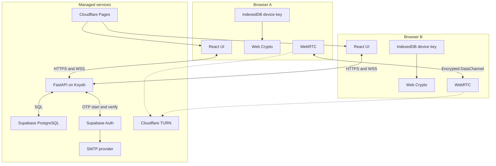
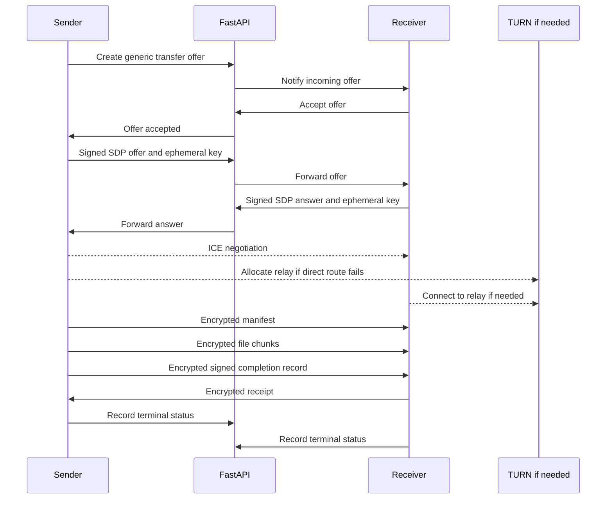

# Architecture

## System shape

The application has a control plane and a data plane. FastAPI owns the control plane: accounts, sessions, devices, presence, signaling, and TURN authorization. Browsers own the data plane: they agree on transfer keys, encrypt the file, and move it over WebRTC.



## Component responsibilities

### React client

The client renders account, device, and transfer state. It generates device and transfer keys with Web Crypto, stores the non-extractable device key in IndexedDB, verifies peer signatures, encrypts and decrypts transfer frames, and manages WebRTC backpressure.

The client treats file names and MIME types as untrusted display data. It does not render transferred HTML or automatically open a received file.

### FastAPI

FastAPI is the only public application backend. Its responsibilities are:

- proxying the start and verification steps for Supabase email OTP
- creating opaque application sessions and CSRF tokens
- issuing and checking device-authentication challenges
- registering, listing, and revoking devices
- coordinating pairing approval
- tracking online device presence
- forwarding WebRTC descriptions and ICE candidates
- issuing short-lived TURN credentials after authorization
- recording limited security and transfer events
- enforcing account ownership, quotas, expiry, and rate limits

FastAPI does not accept file uploads. A route that could receive an arbitrary file body is outside the design.

### Supabase

Supabase Auth proves control of an email address for account bootstrap and recovery. Supabase PostgreSQL stores application records in a private schema. The frontend does not receive the service role key and does not query application tables directly.

FastAPI connects with a dedicated database role limited to the tables and operations it needs. Migrations own schema changes. If any table is placed in an exposed schema, it must have row-level security and must not grant broad access to `anon` or `authenticated`.

### Cloudflare Pages

Pages hosts the static Vite build. It does not run the application API. Static hosting should set the Content Security Policy and the other browser security headers described in [deployment.md](deployment.md).

### Cloudflare TURN

TURN is a fallback relay for WebRTC. FastAPI obtains or creates time-limited credentials only for an authenticated, accepted transfer. The relay can observe IP addresses, timing, and volume, but application encryption prevents it from reading the manifest or file.

### SMTP provider

Supabase Auth calls a configured SMTP service. Application code does not contain a Resend dependency. The public deployment stays disabled for arbitrary email recipients until a sending domain passes SPF and DKIM verification.

## Public hostnames

The placeholders below will be replaced after `is-a.dev` approval.

| Host | Purpose |
| --- | --- |
| `PROJECT.is-a.dev` | React application |
| `api.PROJECT.is-a.dev` | FastAPI HTTPS and WSS |
| `auth.PROJECT.is-a.dev` | Transactional email sender domain |

The frontend and API are separate origins but the same site. FastAPI must allow only the exact production and development frontend origins. The session cookie stays host-only to the API rather than using a broad domain cookie.

## Authentication boundary

The browser never stores a Supabase refresh token. During email bootstrap or recovery, FastAPI completes the OTP exchange, validates the returned identity, creates an application user or recovery transaction, and issues its own opaque session.

The session cookie contains a random identifier, not a JWT or user data. The database stores only its cryptographic hash. FastAPI checks revocation, idle expiry, absolute expiry, the associated device, and the account device epoch on each authenticated request.

A trusted device whose application session has expired can sign a fresh challenge. The signature proves possession of the registered device key and allows FastAPI to issue a new session without another email.

## WebSocket boundary

An authenticated HTTP request creates a single-use WebSocket ticket with a short expiry. The client presents that ticket when opening the socket. FastAPI consumes it once, verifies the `Origin` header, associates the connection with one session and device, then publishes presence.

The socket accepts only typed signaling messages with bounded payloads. Every transfer message includes a transfer identifier, sender device, recipient device, protocol version, and expiry. The backend rejects cross-account routing even if a valid device identifier is supplied.

Presence is advisory. A device may disappear without a clean close, so the backend uses heartbeats and expiry rather than treating a socket close as the only source of truth.

## Transfer sequence



The generic offer does not contain a file name, MIME type, or size. The receiver learns those values from the encrypted manifest after accepting and completing the authenticated handshake.

## Availability and scaling

Version 1 runs one FastAPI instance. In-memory presence is acceptable only as a cache; authoritative sessions, devices, offers, and pairing records live in PostgreSQL. A process restart disconnects WebSockets and cancels active negotiations, but clients can reconnect and begin a new transfer.

Running more than one backend instance would require shared presence and signaling fanout, such as Redis or another pub/sub system. That work is deferred until the single instance becomes a measured limit.

Supabase Free may pause after low activity, and the Koyeb Starter setup has no production SLA. The UI should report backend unavailability plainly rather than presenting a transfer as pending forever.

## Planned repository layout

```text
frontend/
    src/
backend/
    app/
    tests/
shared/
    protocol-fixtures/
supabase/
    migrations/
docs/
```

The TypeScript and Python implementations share versioned protocol fixtures rather than importing runtime code from each other. Fixtures include canonical messages, fingerprints, signatures, derived keys, nonces, and encrypted frames.

