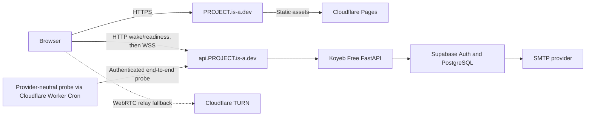

# Deployment

## Environments

The project uses separate development, test, and production settings. Test adapters and test OTP access are never available in production. Production startup validates required variables and refuses unsafe combinations.

| Environment | Frontend | Backend | Database and Auth | Email |
| --- | --- | --- | --- | --- |
| Test | Test runner | In-process FastAPI | Disposable database or fakes | Fake only |
| Development | Vite dev server | Local FastAPI | Development Supabase project or local stack | Team-address testing or fake |
| Production | Cloudflare Pages | Koyeb Free, Frankfurt | Supabase hosted project | Verified custom SMTP |

Local development does not imply local production hosting.

## Production topology



The `PROJECT` label is a placeholder until registration. The `auth.PROJECT.is-a.dev` name is reserved for transactional email DNS records if the provider accepts it.

## Current hosting choices

The figures below were checked on 28 August 2026 and are not contractual.

| Service | Plan | Role | Expected cost |
| --- | --- | --- | ---: |
| Cloudflare Pages | Free | Static frontend | US$0 within plan limits |
| Cloudflare Workers | Free | Scheduled availability probe (Cron Triggers) | US$0 within plan limits |
| Koyeb | Free, one instance in Frankfurt | FastAPI and WebSockets | US$0 within plan limits |
| Supabase | Free | PostgreSQL and Auth | US$0 within plan limits |
| Cloudflare Realtime TURN | Self-service | Relay fallback | First 1,000 GB free, then US$0.05 per outbound GB |
| Resend, if compatible | Free | Auth email | US$0 up to 3,000 emails per month and 100 per day |
| `is-a.dev` | Community service | Public hostname | US$0 |

Source pages:

- [Koyeb instance reference](https://www.koyeb.com/docs/reference/instances)
- [Koyeb scale-to-zero documentation](https://www.koyeb.com/docs/run-and-scale/scale-to-zero)
- [Cloudflare Workers pricing](https://developers.cloudflare.com/workers/platform/pricing/)
- [Cloudflare Workers limits](https://developers.cloudflare.com/workers/platform/limits/)
- [Cloudflare Cron Triggers](https://developers.cloudflare.com/workers/configuration/cron-triggers/)
- [Supabase pricing](https://supabase.com/pricing)
- [Cloudflare Pages limits](https://developers.cloudflare.com/pages/platform/limits/)
- [Cloudflare TURN pricing](https://developers.cloudflare.com/realtime/turn/faq/)
- [Resend pricing](https://resend.com/docs/knowledge-base/what-is-resend-pricing)
- [`is-a.dev` registration guide](https://docs.is-a.dev/quickstart/)

### Free-tier availability operation

The production backend uses one Koyeb Free Instance in Frankfurt, with 512 MB RAM, 0.1 vCPU, and 2 GB of ephemeral disk. The instance uses one Uvicorn worker and automatically scales to zero after one idle hour; this Free behavior cannot be disabled. No custom scaling, persistent volume, or production SLA is part of this setup. These limits and behaviors are documented in the [Koyeb instance reference](https://www.koyeb.com/docs/reference/instances) and [scale-to-zero documentation](https://www.koyeb.com/docs/run-and-scale/scale-to-zero). Durable sessions, devices, offers, pairing records, and other authoritative state remain in Supabase; the Koyeb filesystem is disposable.

The frontend availability module in `frontend/src/availability/` makes a bounded HTTP wake/readiness request before handing control to the existing presence/WebSocket client. The backend availability package in `backend/app/availability/` exposes the minimal safe readiness and probe surface, including a short-timeout database connectivity check. The availability layer does not duplicate the presence client's reconnect logic. A provider-neutral operations probe in `ops/availability-probe/` is deployed separately on a configurable Cloudflare Worker Cron schedule that defaults to three runs per day, and uses a host-stored credential to perform an authenticated end-to-end, database-backed check. It supplies regular genuine database activity for Supabase Free and reports failures, but it does not guarantee that Supabase will never pause. These modules are composed and wired at application boundaries; no Koyeb-specific branches are added to existing presence, transfer, or protocol modules.

The probe package's [deployment README](../ops/availability-probe/README.md) contains the exact Wrangler setup. The backend token is configured in Koyeb's secret store, and the same token is configured in the scheduler's secret store; it must not appear in frontend variables, source, deployment configuration, committed commands, logs, or user-visible errors.

Supabase Free can pause after a low-activity seven-day period and has no automatic backups. The owner must monitor pause warnings, confirm probe failures are investigated, and restore the project if needed. [Supabase pausing documentation](https://supabase.com/docs/guides/platform/free-project-pausing)

If the Free instance's cold starts or resource limits become unsuitable, paid Koyeb Eco Micro in Singapore is the upgrade path. It is not the current deployment choice.

## DNS plan

The intended records are:

```text
PROJECT.is-a.dev            CNAME   <cloudflare-pages-host>
api.PROJECT.is-a.dev        CNAME   <koyeb-host>
```

Email verification adds provider-generated records beneath `auth.PROJECT.is-a.dev`. Their names and values must be copied from the provider rather than predicted in documentation.

The `is-a.dev` maintainers review DNS changes. The project owner does not control the parent Cloudflare zone, so zone-level WAF rules and emergency DNS changes are unavailable. Buying a domain remains the migration path if that limitation becomes material.

## Email release gate

Supabase's default SMTP is suitable only for development with organization-member addresses. Production email OTP remains disabled until a custom provider can deliver to arbitrary recipients.

The Resend test consists of:

1. register the project and nested authentication subdomain
2. add the sending domain in Resend
3. submit the exact SPF and DKIM records through `is-a.dev`
4. wait for DNS publication and Resend verification
5. send to test inboxes on at least two unrelated providers
6. inspect headers for SPF and DKIM pass results
7. configure Supabase custom SMTP and complete a real OTP flow

Resend says it requires a domain the sender owns rather than a shared or public domain. Verification of the community-managed `is-a.dev` subdomain is uncertain, so failure triggers the purchased-domain fallback. [Resend domain requirements](https://resend.com/docs/dashboard/domains/introduction)

The Resend API key is entered into Supabase's secret SMTP configuration. It is not stored in frontend, backend, DNS, documentation, or repository files.

## Configuration

Names below define categories rather than a final configuration library API.

### Frontend public configuration

```text
VITE_API_ORIGIN
VITE_PROTOCOL_VERSION
VITE_MAX_FILE_BYTES
```

These values are public by design. The frontend has no Supabase service key, database password, SMTP credential, or TURN secret.

### Backend non-secret configuration

```text
APP_ENV
APP_ORIGIN
API_ORIGIN
COOKIE_NAME
SESSION_IDLE_SECONDS
SESSION_ABSOLUTE_SECONDS
PAIRING_TTL_SECONDS
TRANSFER_OFFER_TTL_SECONDS
MAX_FILE_BYTES
LOG_LEVEL
```

### Backend secrets

```text
DATABASE_URL
SUPABASE_URL
SUPABASE_PUBLISHABLE_KEY
SUPABASE_SECRET_KEY
SESSION_HMAC_KEY
RATE_LIMIT_HMAC_KEY
CLOUDFLARE_TURN_KEY_ID
CLOUDFLARE_TURN_API_TOKEN
AVAILABILITY_PROBE_TOKEN
```

Only variables needed by the chosen Supabase server flow should exist. A secret or service-role key never uses a `VITE_` prefix. Koyeb stores production secrets in its secret mechanism.

The availability probe token is configured separately in the Koyeb and scheduler host secret stores. It is never placed in frontend configuration, source, logs, or user-visible errors.

SMTP credentials live in Supabase rather than Koyeb for the normal SMTP design. If a future Send Email Hook is used, its credentials move to the hook's secret store.

## Frontend hardening

Cloudflare Pages serves security headers from version-controlled configuration. The initial policy should include:

- Content Security Policy with `default-src 'self'`
- scripts restricted to the built application
- `object-src 'none'`
- `base-uri 'none'`
- `frame-ancestors 'none'`
- an explicit `connect-src` for the API and required services
- `Referrer-Policy: no-referrer`
- `X-Content-Type-Options: nosniff`
- a restrictive `Permissions-Policy`
- HSTS after every production hostname works over HTTPS

Inline scripts and remote analytics are omitted from version 1. Source maps are either private or reviewed to make sure they contain no secrets.

## Backend hardening

Koyeb Free runs a pinned container image as a non-root user with one Uvicorn worker. The image contains only runtime files. FastAPI sits behind Koyeb TLS and trusts forwarded headers only from the platform configuration.

The API sets bounded request sizes and timeouts, validates `Host` and `Origin`, uses exact CORS origins, and never enables credentialed wildcard CORS. Documentation endpoints can be disabled or access controlled in production if they expose internal schemas.

Health checks and availability probes do not query or display secret values. Readiness may test database connectivity with a short timeout, while the authenticated probe route returns only a safe status. Shutdown stops new offers, closes sockets, and gives active requests a bounded drain period.

## Database deployment

Migrations run as a separate deployment step, not during every application process start. FastAPI uses a pooled PostgreSQL connection suitable for the selected Supabase endpoint. The runtime role cannot create schemas, change grants, or read Supabase Auth internals beyond the approved integration path.

Free projects lack downloadable automatic backups. Before a public schema migration, export the schema and any necessary test data through a documented manual process. Backups containing personal data require encryption and a retention limit.

## TURN controls

The backend creates credentials only for an accepted transfer between active devices. TTL, issue count, and concurrent allocations are limited. Cloudflare usage should be monitored because relayed files can consume the only usage-based part of the design.

The client prefers direct connectivity but exposes whether a relay was used for troubleshooting. It does not treat direct connectivity as more secure because both routes use the same application encryption.

## Deployment checks

A production release must verify:

- every hostname has a valid certificate
- frontend and API origins match configuration exactly
- cookies have the intended security attributes
- unsafe requests fail without the CSRF header
- WebSockets reject foreign origins and reused tickets
- the frontend performs HTTP-first wake/readiness before WSS, and the existing presence client reconnects after a Koyeb cold start or restart
- the Koyeb deployment has one Uvicorn worker, 512 MB RAM, 0.1 vCPU, 2 GB ephemeral disk, automatic non-disableable one-hour idle scale-to-zero, no persistent volume, and no custom scaling
- the database role cannot access tables outside its grants
- the Supabase service secret is absent from browser bundles
- the scheduled availability probe authenticates, performs a genuine database-backed end-to-end check, and exposes observable failures without sensitive diagnostics
- Supabase pause warnings are monitored and the pause/restore runbook is complete; probe activity is not treated as a guarantee against pausing
- email OTP works for external recipients
- a forced TURN transfer completes
- logs contain no OTP, token, private-key, file-name, SDP, or ICE values
- environment names and error pages do not expose stack traces
