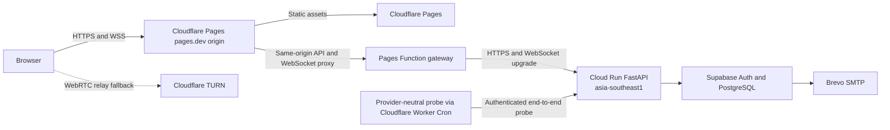

# Deployment

## Environments

The project uses separate development, test, and production settings. Test adapters and test OTP access are never available in production. Production startup validates required variables and refuses unsafe combinations.

| Environment | Frontend and browser origin | Backend | Database and Auth | Email |
| --- | --- | --- | --- | --- |
| Test | Test runner | In-process FastAPI | Disposable database or fakes | Fake only |
| Development | Vite dev server | Local FastAPI | Development Supabase project or local stack | Team-address testing or fake |
| Production | Cloudflare Pages and a same-origin Pages Function gateway | Google Cloud Run in Singapore | Supabase hosted project | Brevo custom SMTP |

Local development does not imply local production hosting. Phase 11 production deployment and validation are complete.

## Production topology



Cloudflare assigns the public application a `*.pages.dev` hostname, and Cloud Run assigns the backend a `*.run.app` hostname. The project does not require a purchased or community-managed domain for version 1.

The browser uses the Pages hostname for static files, API requests, and WebSockets. A narrowly scoped Pages Function forwards the application API and WebSocket routes to Cloud Run. Keeping browser traffic on one origin allows the existing secure, host-only `__Host-session` cookie to work without `SameSite=None` or third-party-cookie assumptions. The Cloud Run URL remains the upstream endpoint and the target of the authenticated operations probe.

## Current hosting choices

The figures below were checked on 29 August 2026 and are not contractual.

| Service | Plan | Role | Expected cost |
| --- | --- | --- | ---: |
| Cloudflare Pages | Free | Static frontend and public `pages.dev` hostname | US$0 within plan limits |
| Cloudflare Pages Functions / Workers | Free | Same-origin gateway and scheduled availability probe | US$0 within plan limits |
| Google Cloud Run | Request-based billing, `asia-southeast1` | FastAPI and WebSockets | Expected US$0 at the planned traffic level, within free-tier usage |
| Supabase | Free | PostgreSQL and Auth | US$0 within plan limits |
| Cloudflare Realtime TURN | Self-service | Relay fallback | First 1,000 GB free, then usage based |
| Brevo | Free | Transactional authentication email | US$0 up to 300 sends per day |

Cloud Run requires an attached billing account even when usage remains inside the free tier. Singapore is a Tier 2 region, and network egress or usage beyond the free allowance can create charges. Set a small billing budget and alerts; a budget is visibility rather than a hard spending cap.

Source pages:

- [Cloud Run overview](https://cloud.google.com/run/docs/overview/what-is-cloud-run)
- [Cloud Run pricing](https://cloud.google.com/run/pricing)
- [Cloud Run locations](https://cloud.google.com/run/docs/locations)
- [Cloud Run WebSockets](https://cloud.google.com/run/docs/triggering/websockets)
- [Cloud Run Secret Manager integration](https://cloud.google.com/run/docs/configuring/services/secrets)
- [Cloudflare Pages Functions](https://developers.cloudflare.com/pages/functions/)
- [Cloudflare Workers pricing](https://developers.cloudflare.com/workers/platform/pricing/)
- [Cloudflare Cron Triggers](https://developers.cloudflare.com/workers/configuration/cron-triggers/)
- [Supabase custom SMTP](https://supabase.com/docs/guides/auth/auth-smtp)
- [Supabase pricing](https://supabase.com/pricing)
- [Cloudflare Pages limits](https://developers.cloudflare.com/pages/platform/limits/)
- [Cloudflare TURN pricing](https://developers.cloudflare.com/realtime/turn/faq/)
- [Brevo free-plan limits](https://help.brevo.com/hc/en-us/articles/208580669-FAQs-What-are-the-limits-of-the-Free-plan)
- [Brevo transactional SMTP](https://help.brevo.com/hc/en-us/articles/7924908994450-Send-transactional-emails-using-Brevo-SMTP)

### Scale-to-zero operation

The production FastAPI service runs in Cloud Run region `asia-southeast1` with request-based billing, zero minimum instances, one maximum instance, and one Uvicorn worker. Cloud Run can therefore scale the service to zero when idle. Its container filesystem is disposable; durable sessions, devices, offers, pairing records, and other authoritative state remain in Supabase.

The one-instance limit preserves the version 1 in-memory presence and signaling design and bounds cost. It also limits availability and throughput. A new revision can briefly overlap an old revision while existing requests drain, so deployments should avoid active transfers and should not split traffic between revisions. More than one serving instance requires shared presence and signaling fanout before the limit is raised.

Cloud Run treats a WebSocket as a long-running HTTP request. Configure the request timeout to 60 minutes, keep HTTP/2 end-to-end disabled for the WebSocket service, and retain the client's heartbeat and reconnect behavior. A timeout, deployment, scale-in, or platform restart may still disconnect a socket and cancel an active negotiation.

The frontend availability module in `frontend/src/availability/` makes a bounded HTTP wake/readiness request through the Pages gateway before handing control to the existing presence/WebSocket client. The backend availability package in `backend/app/availability/` exposes the minimal safe readiness and probe surface, including a short-timeout database connectivity check. These modules remain provider-neutral and do not duplicate the presence client's reconnect logic.

A separate probe in `ops/availability-probe/` runs on a configurable Cloudflare Worker Cron schedule that defaults to three runs per day. It calls the Cloud Run upstream directly with a host-stored credential and performs an authenticated database-backed check. This creates genuine Supabase activity and reports failures, but it does not guarantee that Supabase Free will never pause.

The probe package's [deployment README](../ops/availability-probe/README.md) contains the Wrangler setup. Store the backend token in Google Secret Manager and the matching scheduler token in the Cloudflare secret store. It must not appear in frontend variables, source, committed commands, logs, or user-visible errors.

Supabase Free can pause after a low-activity period and has limited backup features. The owner must monitor pause warnings, investigate probe failures, and test the restore procedure. [Supabase pausing documentation](https://supabase.com/docs/guides/platform/free-project-pausing)

## Public URLs and same-origin gateway

Version 1 uses provider-assigned URLs instead of DNS records:

| URL | Purpose |
| --- | --- |
| `https://<pages-project>.pages.dev` | Public application origin, API entry point, and WebSocket entry point |
| Cloud Run's assigned `https://*.run.app` URL | Gateway upstream and authenticated operations probe target |

The gateway forwards only the required API, availability, health, and WebSocket routes. It preserves the browser's `Origin`, cookie, CSRF, WebSocket upgrade, and safe response headers. It must not log cookies, authorization values, WebSocket tickets, OTPs, or response bodies.

Direct browser use of the `run.app` URL is unsupported. The Cloud Run service is nevertheless Internet reachable so the gateway and operations probe can invoke it. FastAPI authentication, exact Origin checks, CSRF protection, rate limits, bounded bodies, and WebSocket tickets therefore remain required at the upstream service rather than being delegated to Cloudflare.

## Email release gate

Supabase's default SMTP is suitable only for limited development use and organization-member addresses. Production email OTP uses Brevo as Supabase Auth's custom SMTP provider.

The Brevo setup consists of:

1. create a Brevo account and enable transactional email
2. add a sender address controlled by the project owner and verify the code Brevo sends to it
3. create an SMTP key dedicated to SelfRelay
4. configure Supabase custom SMTP with `smtp-relay.brevo.com`, port `587`, the Brevo SMTP login, the SMTP key, the verified sender address, and sender name `SelfRelay`
5. review the Supabase Auth email rate limit and keep the application-level OTP limits stricter where appropriate
6. complete bootstrap and recovery OTP flows using external Gmail and Outlook recipients, checking delivery time and spam placement
7. record the sender address shown by each provider before enabling public sign-up

Without an owned domain, SPF, DKIM, and DMARC cannot be configured for the personal sender's domain. Brevo may replace a free sender address with a provider-managed transactional address. That is accepted for the version 1 demonstration, but it is less recognizable and may have weaker deliverability than an authenticated custom domain. A future owned domain can be added without changing the FastAPI, frontend, or transfer protocol.

The Brevo SMTP key is entered only in Supabase's protected SMTP configuration. It is not stored in FastAPI, the frontend, Google Cloud, DNS, documentation, or repository files.

Production validation on August 30, 2026 confirmed OTP delivery and verification with external Gmail and Outlook recipients. The Outlook message displayed `SelfRelay <selfrelay@11807718.brevosend.com>` as its sender identity. The release checks also verified a forced TURN transfer, direct-first restoration, an authenticated browser reconnect after a Cloud Run revision restart, and no known secret patterns in the live bundle or recent Cloud Run logs.

## Configuration

Names below define categories rather than a final configuration library API.

### Frontend public configuration

```text
VITE_API_ORIGIN
VITE_PROTOCOL_VERSION
VITE_MAX_FILE_BYTES
```

In production, `VITE_API_ORIGIN` is the same `https://<pages-project>.pages.dev` origin that serves the frontend. These values are public by design. The frontend has no Supabase secret key, database password, SMTP credential, or TURN secret.

The Pages Function gateway stores the Cloud Run upstream URL as deployment configuration. Any future gateway credential belongs in the Cloudflare secret store, never in a `VITE_*` variable.

### Backend non-secret configuration

```text
APP_ENV
APP_ORIGIN
API_ORIGIN
COOKIE_NAME
SESSION_IDLE_SECONDS
SESSION_ABSOLUTE_SECONDS
PAIRING_TTL_SECONDS
TRANSFER_OFFER_TTL_SECONDS
MAX_FILE_BYTES
LOG_LEVEL
```

`APP_ORIGIN` is the exact public Pages origin. Cloud Run receives that browser `Origin` through the gateway and rejects other browser origins. `API_ORIGIN` identifies the Cloud Run service origin where the backend requires its own externally assigned URL.

### Backend secrets

```text
DATABASE_URL
SUPABASE_URL
SUPABASE_PUBLISHABLE_KEY
SUPABASE_SECRET_KEY
SESSION_HMAC_KEY
RATE_LIMIT_HMAC_KEY
CLOUDFLARE_TURN_KEY_ID
CLOUDFLARE_TURN_API_TOKEN
AVAILABILITY_PROBE_TOKEN
```

Only variables needed by the chosen Supabase server flow should exist. A secret or service-role key never uses a `VITE_` prefix. Cloud Run reads production secrets from Google Secret Manager through a dedicated service account with access only to the required secrets. Pin secret versions for environment-variable injection and rotate them deliberately.

The availability probe token is configured separately in Google Secret Manager and the Cloudflare scheduler secret store. SMTP credentials live in Supabase rather than Cloud Run. If a future Send Email Hook is used, its credentials move to the hook's secret store.

## Frontend and gateway hardening

Cloudflare Pages serves security headers from version-controlled configuration. The initial policy should include:

- Content Security Policy with `default-src 'self'`
- scripts restricted to the built application
- `object-src 'none'`
- `base-uri 'none'`
- `frame-ancestors 'none'`
- `connect-src 'self'` for the same-origin API and WebSocket gateway
- `Referrer-Policy: no-referrer`
- `X-Content-Type-Options: nosniff`
- a restrictive `Permissions-Policy`
- HSTS after every production hostname works over HTTPS

Inline scripts and remote analytics are omitted from version 1. Source maps are either private or reviewed to make sure they contain no secrets. The gateway has explicit routes and methods, bounded request handling, no generic open-proxy behavior, and no sensitive logging.

## Backend hardening

Cloud Run runs a pinned container image as a non-root user with one Uvicorn worker. The image contains only runtime files and listens on Cloud Run's injected `PORT`. FastAPI trusts forwarded headers only from the documented gateway and platform path.

Set request-based billing, zero minimum instances, one maximum instance, a 60-minute request timeout, and a small CPU and memory allocation validated by a smoke test. Configure a billing budget and alerts. Cloud Run's maximum-instance setting is a cost and architecture bound, not a denial-of-service control or an absolute spending cap.

The API sets bounded request sizes and timeouts, validates `Host` and `Origin`, uses exact CORS origins, and never enables credentialed wildcard CORS. Documentation endpoints can be disabled or access controlled in production if they expose internal schemas.

Health checks and availability probes do not query or display secret values. Readiness may test database connectivity with a short timeout, while the authenticated probe route returns only a safe status. Shutdown stops new offers, closes sockets, and gives active requests a bounded drain period.

## Database deployment

Migrations run as a separate deployment step, not during every application process start. FastAPI uses a small PostgreSQL pool suitable for a single Cloud Run instance and the selected Supabase connection endpoint. The runtime role cannot create schemas, change grants, or read Supabase Auth internals beyond the approved integration path.

Free projects lack downloadable automatic backups. Before a public schema migration, export the schema and any necessary test data through a documented manual process. Backups containing personal data require encryption and a retention limit.

## TURN controls

The backend creates credentials only for an accepted transfer between active devices. TTL, issue count, and concurrent allocations are limited. Cloudflare usage should be monitored because relayed files can consume the only usage-based part of the design.

The client prefers direct connectivity but exposes whether a relay was used for troubleshooting. It does not treat direct connectivity as more secure because both routes use the same application encryption.

## Deployment checks

A production release must verify:

- the Pages and Cloud Run URLs have valid certificates
- the browser uses the Pages origin for HTTP and WebSocket traffic rather than calling `run.app` directly
- the gateway forwards only intended routes and preserves WebSocket upgrades without exposing sensitive headers or logs
- frontend and backend origins match configuration exactly
- cookies have the intended `Secure`, `HttpOnly`, `SameSite=Lax`, host-only, and `Path=/` attributes on the Pages origin
- unsafe requests fail without the CSRF header
- WebSockets reject foreign origins and reused tickets
- the frontend performs HTTP-first wake/readiness before WSS, and the presence client reconnects after a Cloud Run cold start, timeout, deployment, or restart
- Cloud Run uses `asia-southeast1`, request-based billing, zero minimum instances, one maximum instance, one Uvicorn worker, and a 60-minute request timeout
- Cloud Run secrets resolve from Google Secret Manager and are absent from the image, browser bundle, and revision's plain configuration
- the database role cannot access tables outside its grants
- the Supabase service secret is absent from browser bundles
- the scheduled availability probe authenticates, performs a genuine database-backed end-to-end check, and exposes observable failures without sensitive diagnostics
- Supabase pause warnings are monitored and the pause/restore runbook is complete; probe activity is not treated as a guarantee against pausing
- Brevo delivers bootstrap and recovery OTPs to external Gmail and Outlook recipients, and the observed sender identity is documented
- a forced TURN transfer completes
- logs contain no OTP, token, private-key, file-name, SDP, ICE, cookie, or SMTP values
- environment names and error pages do not expose stack traces
